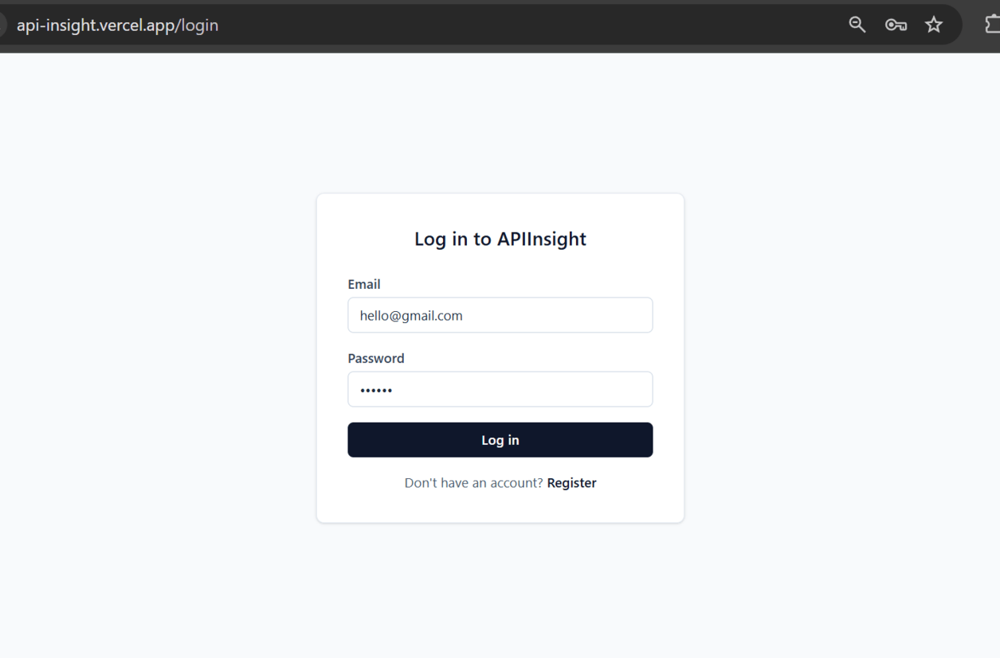
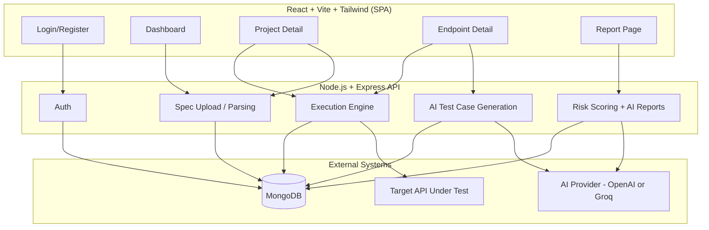

# APIInsight — AI-Powered API Quality Analyzer

Upload an OpenAPI/Swagger spec, let AI generate test cases for every endpoint, run them
against the real API, and get back a risk score, plain-English summary, and concrete
developer suggestions — all in one flow.

**Live demo:** [api-insight.vercel.app](https://api-insight.vercel.app)

**Demo login:** email: hello@gmail.com, password: 123456

## Sample



## Architecture



**Flow:** Upload spec → Swagger Parser validates & dereferences it → endpoints stored →
AI generates test cases per endpoint → execution engine runs them against the real API →
results stored → risk score computed deterministically → AI writes a summary and
suggestions on top of that score.

## Tech stack

| Layer          | Choice                                                                                   |
| -------------- | ---------------------------------------------------------------------------------------- |
| Frontend       | React, Vite, Tailwind CSS v4                                                             |
| Backend        | Node.js, Express                                                                         |
| Database       | MongoDB (Mongoose)                                                                       |
| Auth           | JWT                                                                                      |
| Spec parsing   | Swagger Parser (validates + dereferences OpenAPI/Swagger 2 & 3)                          |
| AI             | OpenAI SDK — works with OpenAI or Groq's free, OpenAI-compatible API                     |
| HTTP execution | Axios                                                                                    |
| Testing        | Jest, Supertest, mongodb-memory-server                                                   |
| Deployment     | Render (backend), Vercel (frontend), MongoDB Atlas — also fully Dockerized for local use |

## Features

- **Auth** — JWT registration/login, protected routes
- **Spec ingestion** — upload `.json`/`.yaml`/`.yml`, or submit a spec URL; validated and
  parsed into individual endpoint records; failed uploads are surfaced with a clear
  reason instead of disappearing silently
- **AI test case generation** — 4–8 test cases per endpoint across positive/negative/
  edge/security categories, generated by an LLM and schema-validated before storage
- **Execution engine** — runs generated test cases against the real target API, records
  actual status code, response time, and response body; correctly distinguishes "got an
  unexpected status" from "never got a response at all"
- **Risk scoring** — deterministic 0–100 score, weighted by failure severity
  (a failing security test costs more than a failing positive test)
- **AI reports** — plain-English summary and developer suggestions generated from the
  score and failure data, with full report history per project

## Engineering highlights

- Risk score is computed with a deterministic formula, not by AI — the number is always
  reproducible; AI is only used for the written summary and suggestions on top of it.
- AI provider is swappable via config (`AI_BASE_URL`) rather than hardcoded to OpenAI —
  the same client and prompt code runs against Groq's OpenAI-compatible API without any
  business logic changes.
- AI responses are schema-validated per test case, not all-or-nothing — a single
  malformed item from the model doesn't discard an otherwise valid batch.
- Execution treats any HTTP response (including 4xx/5xx) as a valid result to record;
  only a request that never got a response at all (timeout, DNS failure) counts as a
  failure.
- Batch test runs execute sequentially, not in parallel, since the target is often a
  third-party API that shouldn't be hit with concurrent load.
- Ownership checks return 404 (not 403) for resources belonging to another user, so a
  request can't be used to confirm whether a resource exists.

## Getting started

**Prerequisites:** Node 20+, MongoDB (local or Docker), an OpenAI or
[Groq](https://console.groq.com) API key (Groq's free tier requires no card).

```bash
# Backend
cd apiinsight-backend
cp .env.example .env      # fill in MONGO_URI, JWT_SECRET, OPENAI_API_KEY
npm install
npm run dev                # http://localhost:5000

# Frontend (new terminal)
cd apiinsight-frontend
cp .env.example .env
npm install
npm run dev                # http://localhost:5173
```

### With Docker

```bash
docker-compose up --build
```

Spins up MongoDB, the backend (port 5000), and the frontend (port 5173) together.

## Testing

```bash
cd apiinsight-backend
npm test
```

60 tests across auth, spec parsing/ownership, AI test generation, execution, risk
scoring, and report generation. AI and HTTP calls are mocked/dependency-injected, so the
suite runs without real API keys or network access — except `mongodb-memory-server`,
which needs internet on its first run to download the MongoDB binary (cached after that).

## Project structure

```
apiinsight-backend/    # Node.js + Express + MongoDB + JWT + Swagger Parser + AI
apiinsight-frontend/   # React + Vite + Tailwind
docker-compose.yml     # spins up mongo + backend + frontend together
```

See each service's own README for endpoint-level detail.

## License

MIT — see [LICENSE](./LICENSE).
