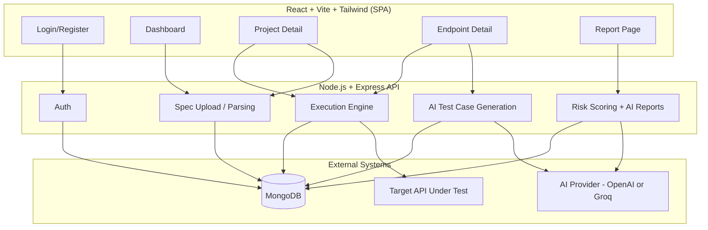

# APIInsight — AI-Powered API Quality Analyzer

Upload an OpenAPI/Swagger spec, let AI generate test cases for every endpoint, run them
against the real API, and get back a risk score, plain-English summary, and concrete
developer suggestions — all in one flow.

**Live demo:** _[add your deployed frontend URL here]_
**Demo login:** _[optional — add a seeded demo email/password so recruiters don't have to register]_

---

## Why this project

Most CRUD-app portfolio projects only prove you can build forms over a database. This one
also involves:
- Parsing and validating third-party file formats (OpenAPI/Swagger, JSON *and* YAML)
- A real third-party AI integration — prompt design, structured JSON output, and
  schema-validating the AI's response before it ever touches the database
- An execution engine that makes real outbound HTTP calls to arbitrary APIs and has to
  handle every failure mode (wrong status, no response at all, oversized response)
- A scoring algorithm that's deliberately **not** AI-generated, so it stays explainable
  and reproducible — AI is only used for the narrative on top of it

## Screenshots

_[Add 3–4 screenshots or a short GIF here: dashboard → endpoint with generated test
cases → execution results → risk report. This is the first thing a recruiter looks at.]_

## Architecture



**Flow:** Upload spec → Swagger Parser validates & dereferences it → endpoints stored →
AI generates test cases per endpoint → execution engine runs them against the real API →
results stored → risk score computed deterministically → AI writes a summary and
suggestions on top of that score.

## Tech stack

| Layer | Choice |
|---|---|
| Frontend | React, Vite, Tailwind CSS v4 |
| Backend | Node.js, Express |
| Database | MongoDB (Mongoose) |
| Auth | JWT |
| Spec parsing | Swagger Parser (validates + dereferences OpenAPI/Swagger 2 & 3) |
| AI | OpenAI SDK (works with OpenAI or Groq's free, OpenAI-compatible API) |
| HTTP execution | Axios |
| Testing | Jest, Supertest, mongodb-memory-server |
| Deployment | Docker + docker-compose (see below for hosted deployment) |

## Features

- **Auth** — JWT registration/login, protected routes
- **Spec ingestion** — upload `.json`/`.yaml`/`.yml`, or submit a spec URL; validated and
  parsed into individual endpoint records; failed uploads are surfaced with a clear
  reason instead of disappearing silently
- **AI test case generation** — 4–8 test cases per endpoint across positive/negative/
  edge/security categories, generated by an LLM and schema-validated before storage
- **Execution engine** — runs generated test cases against the real target API, records
  actual status code, response time, and response body; correctly distinguishes "got an
  unexpected status" from "never got a response at all"
- **Risk scoring** — deterministic 0–100 score, weighted by failure severity
  (a failing security test costs more than a failing positive test)
- **AI reports** — plain-English summary and developer suggestions generated from the
  score and failure data, with full report history per project

## Design decisions (things I'd want to explain in an interview)

- **The risk score is not AI-generated.** It's a simple, explainable formula so the
  number is reproducible — AI only writes the narrative on top of it.
- **The AI provider is swappable via config**, not hardcoded to OpenAI — the same client
  code works against Groq's free tier by changing one env var, which is how I developed
  and tested this without needing to pay for API credits.
- **Execution never throws on a 4xx/5xx.** Those are valid results to record. Only a
  request that got no response at all (timeout, DNS failure) is treated as a failure.
- **Batch test runs are sequential, not parallel** — this tool's job is to test someone
  else's API responsibly, not hammer it with concurrent requests.
- **Ownership checks return 404, not 403**, for resources that belong to another user —
  doesn't leak whether the resource exists at all.

## Running locally

**Prerequisites:** Node 20+, MongoDB running locally (or Docker), an OpenAI or
[Groq](https://console.groq.com) API key (Groq's free tier works and needs no card).

```bash
# Backend
cd apiinsight-backend
cp .env.example .env      # fill in MONGO_URI, JWT_SECRET, OPENAI_API_KEY (see comments in the file)
npm install
npm run dev                # http://localhost:5000

# Frontend (new terminal)
cd apiinsight-frontend
cp .env.example .env
npm install
npm run dev                # http://localhost:5173
```

## Running with Docker

```bash
docker-compose up --build
```
Spins up MongoDB, the backend (port 5000), and the frontend (port 5173) together.

## Testing

```bash
cd apiinsight-backend
npm test
```
~40 tests across auth, spec parsing/ownership, AI test generation, execution, risk
scoring, and report generation. AI and HTTP calls are mocked/dependency-injected in
tests, so the suite runs without real API keys or hitting real networks — except
`mongodb-memory-server`, which needs internet access on its first run to download the
MongoDB binary (cached after that).

## Folder structure

```
apiinsight-backend/    # Node.js + Express + MongoDB + JWT + Swagger Parser + AI
apiinsight-frontend/   # React + Vite + Tailwind
docker-compose.yml     # spins up mongo + backend + frontend together
```
See each service's own README for endpoint-level detail.

## License

MIT — see [LICENSE](./LICENSE).
